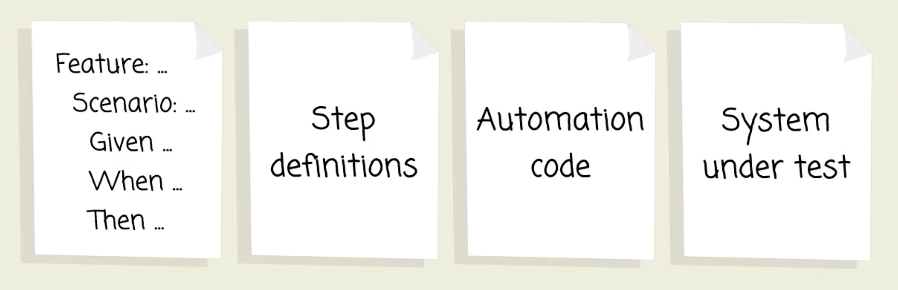

# Notes

## Expressing Yourself

### Cucumber expressions not regular expressions



In the previous chapter we explored the fundamental components of a Cucumber test suite, and how we use Cucumber to drive out a solution, test-first.

First we specified the behaviour we wanted, using a Gherkin scenario in a feature file. Then we wrote step definitions to translate the plain english from our scenario into concrete actions in code. Finally, we used the step definitions to guide us in building out our very basic domain model for the Shouty application.

We tend to think of the code that actually pokes around with the system as distinct from the step definitions, so we’ve drawn an extra box labelled "automation code" for this.

Automation code can do almost anything to your application: it can drive a web browser around your site, make HTTP requests to a REST API, or — as you’ve already seen — drive a domain model directly.

Automation code is a big topic that we’ll come back to. First, we want to concentrate on step definitions. Good step definitions are important because they enable the *readability* of your scenarios. The better you are at matching plain language phrases from Gherkin, the more expressive you can be when writing scenarios. Teams who do this well refer to their features as *living documentation* - a specification document that never goes out of date.

When Cucumber first started, we used to use *regular expressions* to match plain language phrases from Gherkin steps.

Regular expressions have quite an intimidating reputation.

So we replaced them with something simpler, something we call *Cucumber expressions*. Cucumber is backwards compatible so you can still use the power of regular expressions if that’s your thing.

This chapter is all about Cucumber Expressions.

#### Quiz

- A step definition is a piece of code that is called by Cucumber in response to a step in a scenario. You can write any code you like inside a step definition, but we've found it easier to maintain if we keep them short. This leads to step definitions calling dedicated automation code to perform concrete actions against the system under construction. That automation code can manipulate the user interface, make a REST call, or drive the domain model directly.

- Regular Expressions are a powerful tool that have been used in computer science for many decades. They can be hard understand and maintain, so the Cucumber team created a simplified mechanism, called Cucumber Expressions. However, Cucumber remains backwards compatible, so you can use both Regular Expressions and Cucumber Expressions with modern releases of Cucumber.


### Literal expressions

Let’s look at the Shouty scenario from the last chapter.
```
hear_shout.feature
```
```gherkin
Feature: Hear shout
Scenario: Listener is within range
Given Lucy is located 15 metres from Sean
When Sean shouts "free bagels at Sean's"
Then Lucy hears Sean's message
```
As Cucumber starts to execute this feature, it will come to the first step of the scenario Given Lucy is 15 metres from Sean and say to itself "now - do I have any step definitions that match the phrase Lucy is 15 metres from Sean?”"

The most simple cucumber expression that would match that step is this one:
```
Lucy is located 15 metres from Sean
```
That’s pretty simple isn’t it? Cucumber expressions are just string patterns, and the most simple pattern you can use is a perfect match.

In Ruby, we can use this pattern to make a step definition like this:
```ruby
Given("Lucy is located 15 metres from Sean") do
# TODO: automation code to place Lucy and Sean goes here
pending "matched!"
end
```
We use a normal Ruby string to pass the cucumber expression to Cucumber.

#### Quiz

- Cucumber Expressions look for a match of the whole step text EXCLUDING the Gherkin keyword (Given/When/Then/And/But). The match is case sensitive and matches whitespace as well.


### Capturing parameters

Sometimes, we want to write step defintions that allow us to use different values in our Gherkin scenarios. For example, we might want to have other scenarios that place Lucy a different distance away from Sean.
```
hear_shout.feature
```
```gherkin
Feature: Hear shout
  Scenario: Listener is within range
    Given Lucy is located 100 metres from Sean
    When Sean shouts "free bagels at Sean's"
    Then Lucy hears Sean's message
```
To capture interesting values from our step definitions, we can use a feature of Cucumber Expressions called *parameters*.

For example, to capture the number of metres, we can use the `{int}` parameter: which is passed as an argument to our step definition:
```
steps.rb
```
```ruby
Given("Lucy is located {int} metres from Sean") do |distance|
```
Now we’re capturing that value as an argument. The value `100` will be passed to our code automatically by Cucumber.

Because we’ve used Cucumber Expressions' built-in `{int}` parameter type, the value has been cast to an `Integer` data type for us automatically, so we can do maths with it if we want.
```
steps.rb
```
```ruby
Given("Lucy is located {int} metres from Sean") do |distance|
  # TODO: automation code to place Lucy and Sean goes here
  pending "Lucy is #{distance * 100} centimetres from Sean"
end
```
Cucumber has a bunch of built-in parameter types: `{int}`, `{float}`, `{word}` and `{string}`. You can also define your own, as we’ll see later.

#### Quiz

- The Cucumber Expression parameter type that matches an integer is `{int}`, not `{integer}`

- Cucumber will pass the step definition a parameter for each Cucumber Expression parameter type. Cucumber will attempt to convert the text that matched into a suitable format. Using the `{int}` parameter type will result in a number being passed to the step definition. You can extend the predefined Cucumber Expression parameter types, by creating your own.


### Flexibility

Although it’s important to try to use consistent terminology in our Gherkin scenarios to help develop the ubiquitous language of your domain, we also want scenarios to read naturally, which sometimes means allowing a bit of flexibility.

Ideally, the language used in scenarios should never be constrained by your step definitions. Otherwise they’ll end up sounding like they were written by robots. Or worse, they read like code.

One common example is the problem of plurals. Suppose we want to place Lucy and Sean just 1 metre apart:
```gherkin
    Given Lucy is located 1 metre from Sean
```
Because we’ve used the singular `metre` instead of the plural `metres` we don’t get a match:
```shell
$ bundle exec cucumber
Feature: Hear shout

  Scenario: Listener is within range         # features/hear_shout.feature:2
    Given Lucy is located 1 metre from Sean  # features/hear_shout.feature:3
    When Sean shouts "free bagels at Sean's" # features/step_definitions/steps.rb:8
    Then Lucy hears Sean's message           # features/step_definitions/steps.rb:13

1 scenario (1 undefined)
3 steps (2 skipped, 1 undefined)
0m0.017s
```
You can implement step definitions for undefined steps with these snippets:
```gherkin
Given("Lucy is located {int} metre from Sean") do |int|
  pending # Write code here that turns the phrase above into concrete actions
end
```
What a pain!

Fear not. We can just surround the `s` in parentheses to make it optional, like this:
```gherkin
Given("Lucy is located {int} metre(s) from Sean") do |distance|
```
Now our step matches:
```shell
$ bundle exec cucumber
Feature: Hear shout

  Scenario: Listener is within range         # features/hear_shout.feature:2
    Given Lucy is located 1 metre from Sean  # features/step_definitions/steps.rb:3
      Lucy is 100 centimetres from Sean (Cucumber::Pending)
      ./features/step_definitions/steps.rb:5:in `"Lucy is located {int} metre(s) from Sean"'
      features/hear_shout.feature:3:in `Given Lucy is located 1 metre from Sean'
    When Sean shouts "free bagels at Sean's" # features/step_definitions/steps.rb:8
    Then Lucy hears Sean's message           # features/step_definitions/steps.rb:13

1 scenario (1 pending)
3 steps (2 skipped, 1 pending)
```
This is one way to smooth off some of the rough edges in your cucumber expressions, and allow your scenarios to be as expressive as possible.

Another is to allow *alternates* - different ways of saying the same thing. For example, to accept this step:
```gherkin
    Given Lucy is standing 1 metre from Sean
```
…we can use this Cucumber Expression:
```gherkin
Given("Lucy is located/standing {int} metre(s) from Sean") do |distance|
```
Now we can use either 'standing' or 'located' in our scenarios, and both will match just fine:
```shell
$ bundle exec cucumber
Feature: Hear shout

  Scenario: Listener is within range         # features/hear_shout.feature:2
    Given Lucy is standing 1 metre from Sean # features/step_definitions/steps.rb:3
      Lucy is 100 centimetres from Sean (Cucumber::Pending)
      ./features/step_definitions/steps.rb:5:in `"Lucy is located/standing {int} metre(s) from Sean"'
      features/hear_shout.feature:3:in `Given Lucy is standing 1 metre from Sean'
    When Sean shouts "free bagels at Sean's" # features/step_definitions/steps.rb:8
    Then Lucy hears Sean's message           # features/step_definitions/steps.rb:13

1 scenario (1 pending)
3 steps (2 skipped, 1 pending)
```
