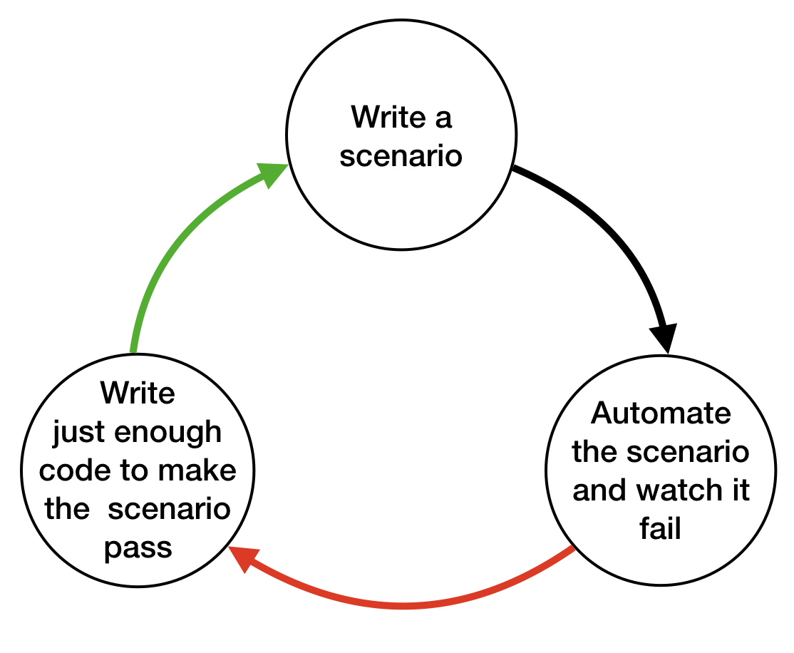

# Notes

## Your first scenario

### Intro

Throughout this course, we're going to be working on a real application, following its development from the ground up, using BDD and Cucumber to guide us along the way.

In this chapter we're going to:

- Learn about Shouty, our example project
- Write out our first scenario in Gherkin
- Install Cucumber
- Use Cucumber to guide us implementing a very naive solution


### Choose the first scenario

Shouty is a social network that allows people who are physically close to communicate, just like people have always communicated with their voices. In the real world you can talk to someone in the same room, or across the street. Or even 100 m away from you in a park - if you shout.

```gherkin
Scenario: Listener is within range
  Given Lucy is located 15m from Sean
  When Sean shouts "free bagels at Sean's"
  Then Lucy hears Sean's message
```

#### Quiz #1
- Gherkin is just one way of expressing examples of how you want your system to behave. The advantage of using this particular format is that you can use Cucumber to test them for you, making them into **Living Documentation**.

- We've introduced four Gherkin keywords so far:
  - **Scenario** tells Cucumber we’re about to describe an example that it can execute.
  - **Given**, **When** and **Then** identify the steps of the scenario.

  There are a few other keywords which will be introduced later in the course.
-
  - **Given** is the *context* for the scenario. We’re putting the system into a specific state, ready for the scenario to unfold.
  - **When** is an *action*. Something that happens to the system that will cause something else to happen: an outcome.
  - **Then** is the *outcome*. It’s the behaviour we expect from the system when this action happens in this context.

- Behaviour-Driven Development practitioners definitely do care about business goals, but when we're writing the **Scenario** part of our Gherkin, we need to focus on the observable, testable behaviour of the system we're building.

  Later in the course we'll show you how you can use other parts of Gherkin documents to add other relevant details, like business goals, to make great executable specifications.


### Install Cucumber

Before we get started make sure you have a modern version of Ruby installed, and the Bundler gem. Open a command-prompt and check the Ruby version, and the version of Bundler, Ruby’s package manager:

```shell
$ ruby -v
$ bundle -v
```
If you see an error message when you run these commands, you’ll need to fix your Ruby installation.

Go back to the command prompt and create a new directory for our project:

```shell
$ mkdir shouty
```
Use `cd` to go into that directory. If you want to, you can open the directory up in your favourite text exitor at this point.

```shell
$ cd shouty
```
First we’ll create a Gemfile that describes the Ruby gems we need for our project. We’ll add Cucumber and RSpec-Expectations.

Gemfile
```ruby
source "https://rubygems.org"

gem "cucumber"
gem "rspec"
```
Now go back to the command-line and run `bundle install` to install those gems.
```shell
$ bundle install
```
Now we’re ready! If we run `cucumber` at this point , we’ll see it’s telling us to create a features directory.
```shell
$ bundle exec cucumber
No such file or directory - features. You can use `cucumber --init` to get started.
```
Good, we’ve installed Cucumber.

As instructed, we can use the cucumber --init command to create the conventional folder structure for our Gherkin specifications and the code that will let Cucumber test them:
```shell
$ cucumber --init
  create   features
  create   features/step_definitions
  create   features/support
  create   features/support/env.rb
```
Now we’re ready to create our first feature file.
```shell
$ bundle exec cucumber
0 scenarios
0 steps
0m0.000s
```

[Cucumber Docs](https://cucumber.io/docs/installation/)


### Add a scenario, wire it up

Let’s create our first feature file. Call the file `hear_shout.feature`
```shell
$ touch features/hear_shout.feature
```
All feature files start with the keyword `Feature:` followed by a name. It’s a good convention to give it a name that matches the file name.

Now let’s write out our first scenario.
```
hear_shout.feature
```
```gherkin
Feature: Hear shout
  Scenario: Listener is within range
    Given Lucy is located 15m from Sean
    When Sean shouts "free bagels at Sean's"
    Then Lucy hears Sean’s message
```
Save the file, switch back to the command-prompt and run `cucumber`.

You’ll see Cucumber has found our feature file and read it back to us. We can see a summary of the test results below the scenario: one scenario, three steps - all undefined.
```shell
$ bundle exec cucumber
Feature: Hear shout

  Scenario: Listener is within range         # features/hear_shout.feature:2
    Given Lucy is located 15m from Sean      # features/hear_shout.feature:3
    When Sean shouts "free bagels at Sean's" # features/hear_shout.feature:4
    Then Lucy hears Sean's message           # features/hear_shout.feature:5

1 scenario (1 undefined)
3 steps (3 undefined)
0m0.051s

You can implement step definitions for undefined steps with these snippets:

Given("Lucy is located {int}m from Sean") do |int|
  pending # Write code here that turns the phrase above into concrete actions
end

When("Sean shouts {string}") do |string|
  pending # Write code here that turns the phrase above into concrete actions
end

Then("Lucy hears Sean's message") do
  pending # Write code here that turns the phrase above into concrete actions
end
```
*Undefined* means Cucumber doesn’t know what to do for any of the three steps we wrote in our Gherkin scenario. It needs us to provide some *step definitions*.

Step definitions translate from the plain language you use in Gherkin into Ruby code.

When Cucumber runs a step, it looks for a step definition that matches the text in the Gherkin step. If it finds one, then it executes the code in the step definition.

If it doesn’t find one… well, you’ve just seen what happens. Cucumber helpfully prints out some code snippets that we can use as a basis for new step definitions.

Let’s copy those to create our first step definitions.

We’ll paste them into a Ruby file under the `step_definitions` directory, inside the features directory. We’ll just call it `steps.rb`.
```
steps.rb
```
```ruby
Given("Lucy is located {int}m from Sean") do |int|
  pending # Write code here that turns the phrase above into concrete actions
end

When("Sean shouts {string}") do |string|
  pending # Write code here that turns the phrase above into concrete actions
end

Then("Lucy hears Sean's message") do
  pending # Write code here that turns the phrase above into concrete actions
end
```
Now run Cucumber again.

This time the output is a little different. None of the steps are undefined anymore. We now have a pending step and two skipped ones. This means Cucumber found all our step definitions, and executed the first one. But that first step definition throws a PendingException, which causes Cucumber to stop, skip the rest of the steps, and mark the scenario as pending.
```shell
$ bundle exec cucumber
Feature: Hear shout

  Scenario: Listener is within range         # features/hear_shout.feature:2
    Given Lucy is located 15m from Sean      # features/step_definitions/steps.rb:1
      TODO (Cucumber::Pending)
      ./features/step_definitions/steps.rb:2:in `"Lucy is located {int}m from Sean"'
      features/hear_shout.feature:3:in `Given Lucy is located 15m from Sean'
    When Sean shouts "free bagels at Sean's" # features/step_definitions/steps.rb:5
    Then Lucy hears Sean's message           # features/step_definitions/steps.rb:9

1 scenario (1 pending)
3 steps (2 skipped, 1 pending)
0m0.008s
```
Now that we’ve wired up our step definitions to the Gherkin steps, it’s almost time to start working on our solution. First though, let’s tidy up the generated code.

We’ll rename the `int` parameter to something that better reflects its meaning. We’ll call it `distance`.

We can print it to the terminal to see what’s happening.
```ruby
Given("Lucy is located {int}m from Sean") do |distance|
  puts distance
  pending # Write code here that turns the phrase above into concrete actions
end

When("Sean shouts {string}") do |string|
  pending # Write code here that turns the phrase above into concrete actions
end

Then("Lucy hears Sean's message") do
  pending # Write code here that turns the phrase above into concrete actions
end
```
If we run `cucumber` again on our terminal, we can see the number 15 pop up in the output.
```shell
$ bundle exec cucumber
Feature: Hear shout

  Scenario: Listener is within range         # features/hear_shout.feature:2
    Given Lucy is located 15m from Sean      # features/step_definitions/steps.rb:1
      15
      TODO (Cucumber::Pending)
      ./features/step_definitions/steps.rb:3:in `"Lucy is located {int}m from Sean"'
      features/hear_shout.feature:3:in `Given Lucy is located 15m from Sean'
    When Sean shouts "free bagels at Sean's" # features/step_definitions/steps.rb:6
    Then Lucy hears Sean's message           # features/step_definitions/steps.rb:10

1 scenario (1 pending)
3 steps (2 skipped, 1 pending)
0m0.005s
```
Notice that the number 15 does not appear anywhere in our Ruby code. The value is automatically passed from the Gherkin step to the step definition. If you’re curious, that’s the `{int}` in the step definition pattern or *cucumber expression*. We’ll explain these patterns in detail in a future lesson.

#### Quiz #4

- Step definitions are Ruby blocks that actually do what's described in each step of a Gherkin scenario.

  When it tries to run each step of a scenario, Cucumber will search for a step definition that matches. If there's a matching step definition, it will execute the code in the block.

- Cucumber tells us that a step (and by inference the Scenario that contains it) is ***Pending*** when the automation code throws a **Pending** error.

  This allows the development team to signal that automation for a step is a work in progress. This makes it possible to tell the difference between steps that are still being worked on and steps that are failing due to a defect in the system.

  For example, when we run our tests in a Continuous Integration (CI) environment, we can choose to ignore pending scenarios.

- When Cucumber generates a snippet, it has no idea of the business context of the undefined step. The implementation that Cucumber generates will definitely not automate what's been written in your Gherkin - that's up to you!

  Also, the name of the method and the parameters are just placeholders. It's the job of the person writing the code to rename the method and parameters to reflect the business domain.

- If you read the comment in the generated snippet, Cucumber is telling you to "turn the phrase above into concrete actions".

  You need your step definition to call your application and do whatever the Gherkin step describes. In the case of our first step here, we want to tell the system that there are two people in certain locations.

  We can use the act of fleshing out the body of our step definition as an opportunity to do some software design. We can think about what we want the interface to our system to look like, from the point of view of someone who needs to interact with it. Should we interact with it through the User Interface, or make a call to the programmer API directly? How would we like that interface to work?

  We can do all of this without writing any implementation yet.

  This is known as "outside-in" development. It helps us to ensure that when we do come to implementing our solution, we're implementing it based on real needs.


### Sketch out the solution

Now that we have the step definitions matching, we can start working on our solution. We like to use our scenarios to *guide* our development, so we’ll start designing the objects we’ll need by sketching out some code in our step definitions.

The scenario will be failing while we do this, but we should see the error messages gradually progressing as we drive out the interface to our object model.

Our next goal is for the scenario to fail because we need to implement the actual business logic. *Then* we can work on changing the business logic inside our objects to make it pass.
```
steps.rb
```
```ruby
Given("Lucy is located {int}m from Sean") do |distance|
  puts distance
  pending # Write code here that turns the phrase above into concrete actions
end

When("Sean shouts {string}") do |string|
  pending # Write code here that turns the phrase above into concrete actions
end

Then("Lucy hears Sean's message") do
  pending # Write code here that turns the phrase above into concrete actions
end
```
To implement the first step, we need to create a couple of `Person` objects, with the specified distance between them. We can remove the `pending` status now, and this `puts` statement, and write the implementation for the first step like this:
```ruby
Given("Lucy is located {int}m from Sean") do |distance|
  @lucy = Shouty::Person.new
  @sean = Shouty::Person.new
  @lucy.move_to(distance)
end

When("Sean shouts “free bagels at Sean’s”") do
  pending # Write code here that turns the phrase above into concrete actions
end

Then("Lucy hears Sean’s message") do
  pending # Write code here that turns the phrase above into concrete actions
end
```
We have two instances of person, one representing Lucy, and one representing Sean. Then we call a method to move Lucy to the position specified in the scenario.

To keep things simple, we’re going to assume all people are situated on a line: a one-dimensional co-ordinate system. We can always introduce proper geo-locations later. We’ll place Sean in the centre, and Lucy 15 metres away from Sean.

This might not be the design we’ll end up with once this is all working, but it’s a decent place to start.

If we run Cucumber, we’ll see a compilation error from Ruby. we need to define our `Shouty` module.
```shell
$ bundle exec cucumber
Feature: Hear shout

  Scenario: Listener is within range         # features/hear_shout.feature:2
    Given Lucy is located 15m from Sean      # features/step_definitions/steps.rb:1
      uninitialized constant Shouty (NameError)
      ./features/step_definitions/steps.rb:2:in `"Lucy is located {int}m from Sean"'
      features/hear_shout.feature:3:in `Given Lucy is located 15m from Sean'
    When Sean shouts "free bagels at Sean's" # features/step_definitions/steps.rb:7
    Then Lucy hears Sean's message           # features/step_definitions/steps.rb:11

Failing Scenarios:
cucumber features/hear_shout.feature:2 # Scenario: Listener is within range

1 scenario (1 failed)
3 steps (1 failed, 2 skipped)
0m0.004s
```
Let’s give our solution a home by creating a `lib` directory. We’ll put our Shouty application in a Ruby file called shouty.rb in that directory.
```shell
$ mkdir lib
$ touch lib/shouty.rb
```
Create a `Shouty` module, then an empty `Person` class inside it.
```
lib/shouty.rb
```
```ruby
module Shouty
  class Person

  end
end
```
For now, we’ll just require the shouty application from our `steps.rb` file. In a later lesson we’ll talk more about how to organise this code a bit better.
```ruby
require 'shouty'

Given("Lucy is located {int}m from Sean") do |distance|
 # ...
end
```
When we run the scenario this time, Cucumber tells us that we’re missing the `move_to` method on the `Person` class.
```shell
$ bundle exec cucumber
Feature: Hear shout

  Scenario: Listener is within range         # features/hear_shout.feature:2
    Given Lucy is located 15m from Sean      # features/step_definitions/steps.rb:3
      undefined method `move_to' for #<Shouty::Person:0x00007fed0da12b68> (NoMethodError)
      ./features/step_definitions/steps.rb:6:in `"Lucy is located {int}m from Sean"'
      features/hear_shout.feature:3:in `Given Lucy is located 15m from Sean'
    When Sean shouts "free bagels at Sean's" # features/step_definitions/steps.rb:9
    Then Lucy hears Sean's message           # features/step_definitions/steps.rb:13

Failing Scenarios:
cucumber features/hear_shout.feature:2 # Scenario: Listener is within range

1 scenario (1 failed)
3 steps (1 failed, 2 skipped)
0m0.004s
```
We’ll add the method definition without implementing it yet.
```ruby
module Shouty
  class Person
    def move_to(distance)

    end
  end
end
```
When we run the scenario again, the first step is green!
```shell
bundle exec cucumber
Feature: Hear shout

  Scenario: Listener is within range         # features/hear_shout.feature:2
    Given Lucy is located 15m from Sean      # features/step_definitions/steps.rb:3
    When Sean shouts "free bagels at Sean's" # features/step_definitions/steps.rb:9
      TODO (Cucumber::Pending)
      ./features/step_definitions/steps.rb:10:in `"Sean shouts {string}"'
      features/hear_shout.feature:4:in `When Sean shouts "free bagels at Sean's"'
    Then Lucy hears Sean's message           # features/step_definitions/steps.rb:13

1 scenario (1 pending)
3 steps (1 skipped, 1 pending, 1 passed)
0m0.006s
```
We’re making progress!

We’ll keep working like this until we see the scenario failing for the right reasons.

In the second step definition, we want to tell Sean to shout something.

In order to send instructions to Sean from the second step, we’ve stored him in an `instance variable`, so that he’ll be accessible from all of our step definitions.

In the `When` step, we’re capturing Sean’s message using the `{string}` pattern, so let’s give that argument a more meaningful name.

And now we can now tell him to shout the message:
```ruby
When("Sean shouts {string}") do |message|
  @sean.shout(message)
end
```
If we run Cucumber, it’s telling is that our `Person` class needs a `shout` method.
```shell
bundle exec cucumber
Feature: Hear shout

  Scenario: Listener is within range         # features/hear_shout.feature:2
    Given Lucy is located 15m from Sean      # features/step_definitions/steps.rb:4
    When Sean shouts "free bagels at Sean's" # features/step_definitions/steps.rb:10
      undefined method `shout' for #<Shouty::Person:0x0000558e1ee78428> (NoMethodError)
      ./features/step_definitions/steps.rb:11:in `"Sean shouts {string}"'
      features/hear_shout.feature:4:in `When Sean shouts "free bagels at Sean's"'
    Then Lucy hears Sean’s message           # features/step_definitions/steps.rb:14

Failing Scenarios:
cucumber features/hear_shout.feature:2 # Scenario: Listener is within range

1 scenario (1 failed)
3 steps (1 failed, 1 skipped, 1 passed)
0m0.003s
```
Let’s not worry about the implementation yet. The most important thing right now is to discover the shape of our domain model.
```
shouty.rb
```
```ruby
module Shouty
  class Person
    def move_to(distance)

    end

    def shout(message)

    end
  end
end
```
The last step definition is where we implement a check, or assertion. We’ll verify that what Lucy has heard is exactly the same as what Sean shouted.

Once again we’re going to write the code we wish we had.
```ruby
Then("Lucy hears Sean's message") do
  expect(@lucy.messages_heard).to include @message_from_sean
end
```
So we need a way to ask Lucy what messages she’s heard, and we also need to know what it was that Sean shouted.

We can record what Sean shouts by storing it in an instance variable as the `When` step runs. This is a common pattern to use in Cucumber step definitions when you don’t want to repeat the same test data in different parts of a scenario. Now we can use that in the assertion check.
```ruby
When("Sean shouts {string}") do |message|
  @sean.shout(message)
  @message_from_sean = message
end
```
We also need to add a `messages_heard` method to our Person class. Let’s do that now, we’ll just return an empty array for now.
```ruby
module Shouty
  class Person
    def move_to(distance)

    end

    def shout(message)

    end

    def messages_heard
      []
    end
  end
end
```
…and watch Cucumber run the tests again.
```shell
$ bundle exec cucumber
Feature: Hear shout

  Scenario: Listener is within range         # features/hear_shout.feature:2
    Given Lucy is located 15m from Sean      # features/step_definitions/steps.rb:4
    When Sean shouts "free bagels at Sean's" # features/step_definitions/steps.rb:10
    Then Lucy hears Sean’s message           # features/step_definitions/steps.rb:15
      expected [] to include "free bagels at Sean's" (RSpec::Expectations::ExpectationNotMetError)
      ./features/step_definitions/steps.rb:16:in `"Lucy hears Sean’s message"'
      features/hear_shout.feature:5:in `Then Lucy hears Sean’s message'

Failing Scenarios:
cucumber features/hear_shout.feature:2 # Scenario: Listener is within range

1 scenario (1 failed)
3 steps (1 failed, 2 passed)
0m0.032s
```
This is great! Whenever we do BDD, getting to our first failing test is a milestone. Seeing the test fail proves that it is capable of detecting errors in our code!

Never trust an automated test that you haven’t seen fail!

Now all we have to do is write the code to make it do what it’s supposed to.

#### Quiz

- Behaviour-driven development follows the same process as test-driven development, which is sometimes described as red-green-refactor.

  - red - write a scenario/test and see it fail
  - green - make it pass (as simply as possible)
  - refactor - improve your code, while keeping all the tests/scenarios green

  It's surprisingly easy to write scenarios and step definitions that don't do anything. It's the transition from red to green that gives us confidence that the scenario and the implementation actually do what we expect.

  If a scenario passes as soon as we write it, that means that either it's not doing what we think it should or the behaviour that it describes has already been implemented. In that case, we're not developing using behaviour-driven development.

- In Cucumber, one of the ways to access the same instance of an object from different step definition methods, is to store it on an instance variable.

- When you need to assert for a specific value coming out of your system in a **Then** step, you can use an instance variable to store it where it goes into the system (in a **Given** or **When**) step. This means you can avoid duplicating the value in multiple places in your code.

- Our goal at this stage is to get to a failing test, where the only thing left to do to make it pass is make changes to the implementation of the app itself.

  On an existing system, we might not need to create so much new code to get to this goal, but we might need to make some changes to how we call the system. This gives us an opportunity to do some lightweight domain modelling.

  It may not compile first-time, so we implement the bare-bones of our solution until it does.

  We use the scenarios to guide us in our implementation.


### Make the scenario pass
```shell
bundle exec cucumber
Feature: Hear shout

  Scenario: Listener is within range         # features/hear_shout.feature:2
    Given Lucy is located 15m from Sean      # features/step_definitions/steps.rb:4
    When Sean shouts "free bagels at Sean's" # features/step_definitions/steps.rb:10
    Then Lucy hears Sean’s message           # features/step_definitions/steps.rb:15
      expected [] to include "free bagels at Sean's" (RSpec::Expectations::ExpectationNotMetError)
      ./features/step_definitions/steps.rb:16:in `"Lucy hears Sean’s message"'
      features/hear_shout.feature:5:in `Then Lucy hears Sean’s message'

Failing Scenarios:
cucumber features/hear_shout.feature:2 # Scenario: Listener is within range

1 scenario (1 failed)
3 steps (1 failed, 2 passed)
0m0.032s
```
Lucy is expected to hear Sean’s message, but she hasn’t heard anything: we got an empty Array back from the `messages_heard` method.

In this case, we’re going to cheat. We have a one-line fix that will make this scenario pass, but it’s not a particularly future-proof implementation. Can you guess what it is?
```ruby
module Shouty
  class Person
    def move_to(distance)

    end

    def shout(message)

    end

    def messages_heard
      ["free bagels at Sean's"]
    end
  end
end
```
I told you it wasn’t very future proof!
```shell
$ bundle exec cucumber
Feature: Hear shout

  Scenario: Listener is within range         # features/hear_shout.feature:2
    Given Lucy is located 15m from Sean      # features/step_definitions/steps.rb:4
    When Sean shouts "free bagels at Sean's" # features/step_definitions/steps.rb:10
    Then Lucy hears Sean’s message           # features/step_definitions/steps.rb:15

1 scenario (1 passed)
3 steps (3 passed)
0m0.028s
```
Woohoo! Our scenario is passing for the first time. As long as this is the only message anyone ever shouts, we’re good to ship this thing!

Now, the fact that such a poor implementation can pass our tests shows us that we need to work on our tests. A more comprehensive set of scenarios would guide us towards a better implementation.

It’s also a good habit to look for the most simple solution. We can trust that, as our scenarios evolve, so will our solution.

This is the essence of Behaviour-Driven Development. Examples of behaviour drive the development. We do just enough to make the next scenario pass, and no more.

Instead of writing a note on our TODO list, let’s write another scenario that shouts a different message.
```gherkin
Feature: Hear shout
  Scenario: Listener is within range
    Given Lucy is located 15m from Sean
    When Sean shouts "free bagels at Sean's"
    Then Lucy hears Sean’s message

  Scenario: Listener hears a different message
    Given Lucy is located 15m from Sean
    When Sean shouts "Free coffee!"
    Then Lucy hears Sean's message
```
It fails, reminding us we need to find a solution that doesn’t rely on hard-coding the message. Now when we come back to this code, we can just run the tests and Cucumber will remind us what we need to do next. We’re done for today!
```shell
$ bundle exec cucumber
Feature: Hear shout

  Scenario: Listener is within range         # features/hear_shout.feature:2
    Given Lucy is located 15m from Sean      # features/step_definitions/steps.rb:3
    When Sean shouts "free bagels at Sean's" # features/step_definitions/steps.rb:9
    Then Lucy hears Sean's message           # features/step_definitions/steps.rb:14

  Scenario: Listener hears a different message # features/hear_shout.feature:7
    Given Lucy is located 15m from Sean        # features/step_definitions/steps.rb:3
    When Sean shouts "Free coffee!"            # features/step_definitions/steps.rb:9
    Then Lucy hears Sean's message             # features/step_definitions/steps.rb:14
      expected ["free bagels at Sean's"] to include "Free coffee!" (RSpec::Expectations::ExpectationNotMetError)
      ./features/step_definitions/steps.rb:15:in `"Lucy hears Sean's message"'
      features/hear_shout.feature:10:in `Then Lucy hears Sean's message'

Failing Scenarios:
cucumber features/hear_shout.feature:7 # Scenario: Listener hears a different message

2 scenarios (1 failed, 1 passed)
6 steps (1 failed, 5 passed)
0m0.039s
```
Of course, if you’re in the mood, you can always try to implement a solution yourself that makes both scenarios pass. Have fun!

#### Quiz

- Our naive implementation of **getMessagesHeard** is rubbish, but it makes our test pass. Here are some advantages of taking a short-cut like this:

  - We've done a quick test of the proposed structure of our code without getting bogged down thinking about the logic.
  - We're teaching outselves a mindset of finding simple solutions that are *good enough for now*.
  - It encourages us not to think of our solution as fixed, and therefore to write code that can easily be changed.
  - It's so bad, it makes it obvious that we need to think about our test cases to find cases that will cover the problem space more fully.

- 
  The last thing we did in the video was to write a new scenario in which Sean shouted "free coffee". Then we ran Cucumber and watched the new scenario fail.

