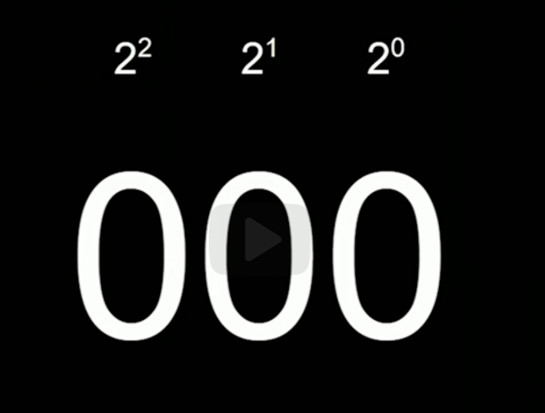
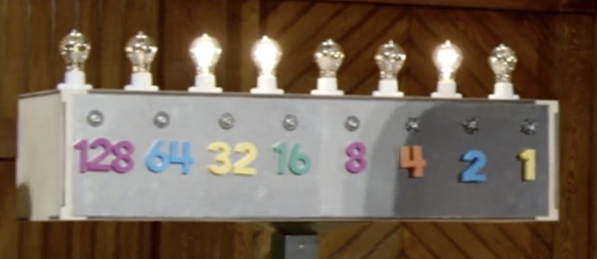
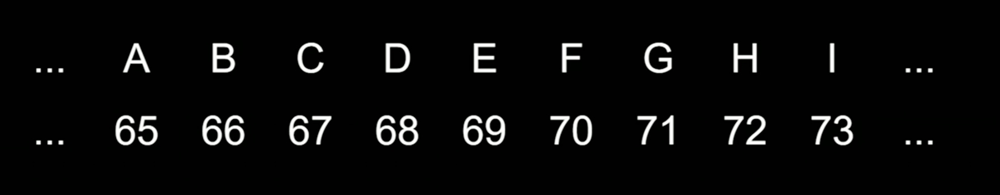
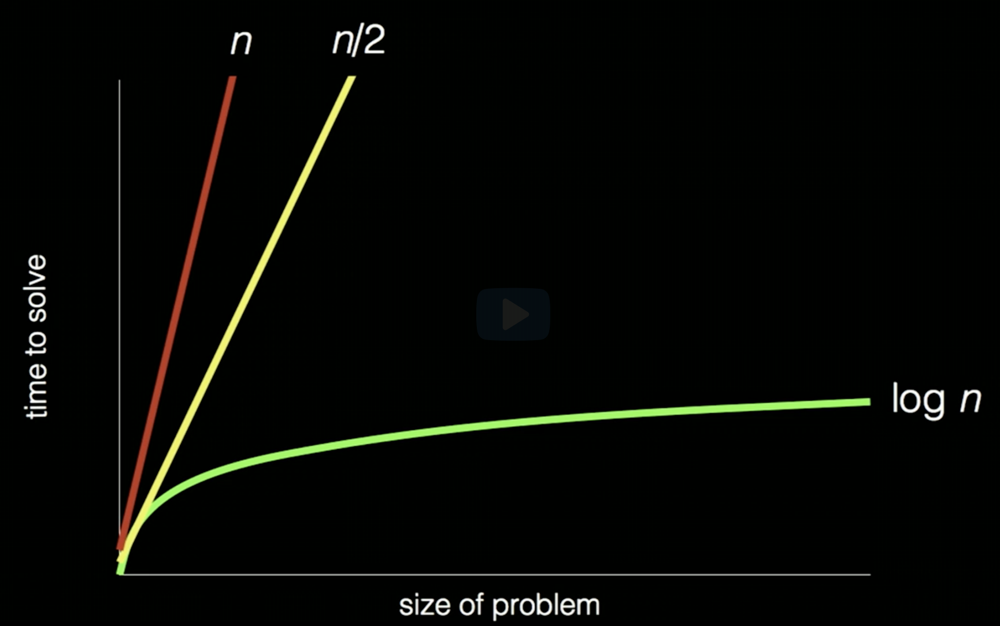
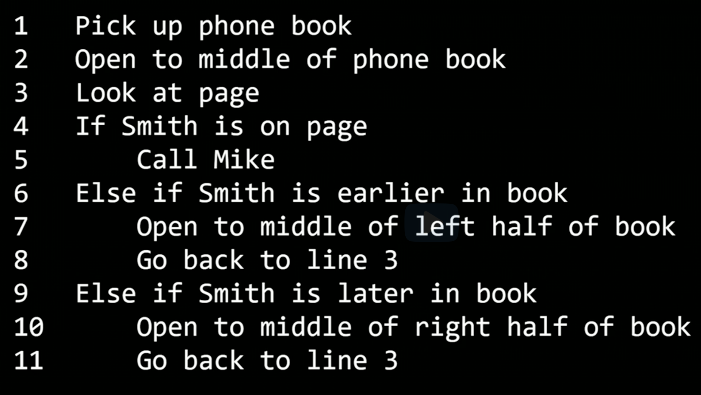

## Lecture 0

- Computer Science is about solving problems

Input -> [black box] -> output

The 'Black Box' is the computer science.

- How to represent an information to be understandable for a computer?

Computers understand binary system -> 0s and 1s.

8 bits = 1 byte -> 8b = 1B

Number 50 represented as lightbulbs:

- How computers represents letters? By digits. A is 65 (ASCII)

- Emojis also have their representation in Unicode
- Images are numbers -> using RGB (Red, Green, Blue), defined as matrix of pixels (points), each of them is represented as a 3 numbers between 0 and 255
- GIFs and videos are just multiple images displayed very quickly to make an impression of move.

- Algorithm - step-by-step instruction to solve a problem

- Complexity of the algorithm

- Pseudocode algorithm

--> TBC
